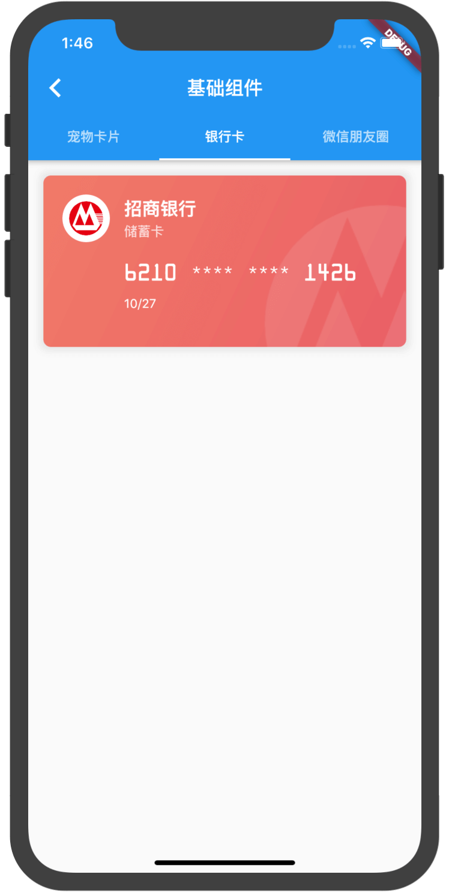
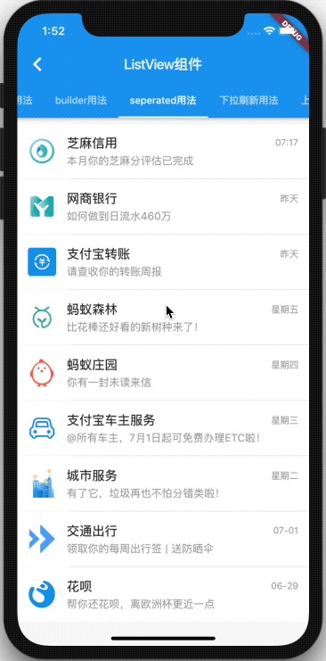
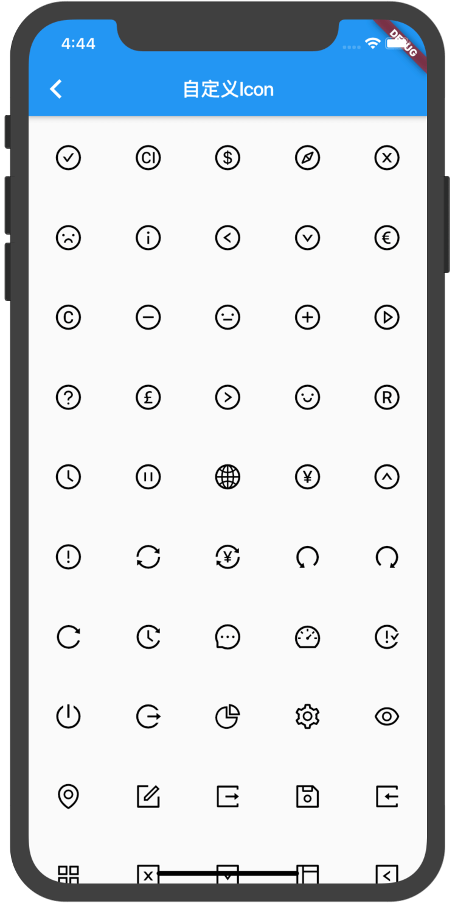
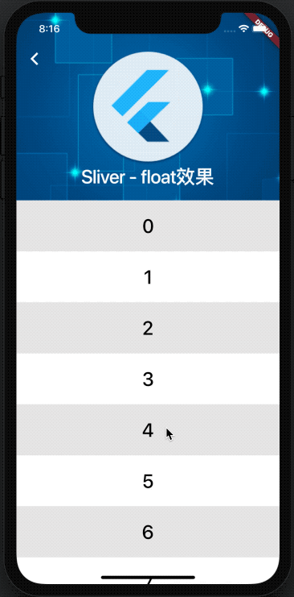
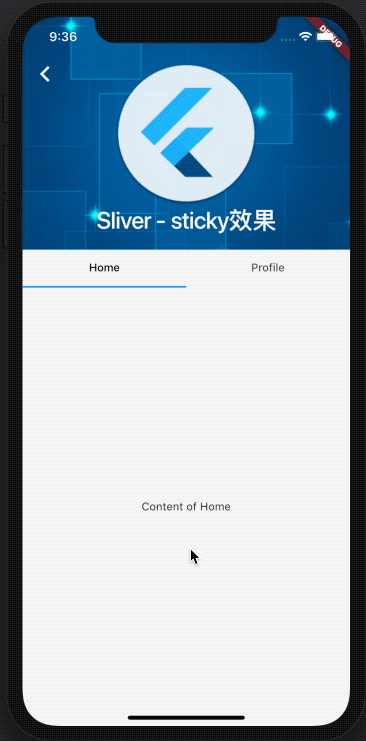

# flutter_training_app

Flutter练习，欢迎Star，一起学习~


## overflow error 解决
[overflow error 解决](https://stackoverflow.com/questions/55312583/overflow-error-in-flutter-when-keyboard-open)

- 报错原因：
  - 1、内容超过可视区，根节点未使用可滚动组件
  - 2、父子容器均不确定高度，flutter不知道如何去渲染


## 模型类自动生成脚本

>执行命令: npm run model 字段名1 字段名2 字段名3 ...

```
如：
npm run model title description routeName

生成：

class GenerateModel {
  final String title;
  final String description;
  final String routeName;

  GenerateModel({
    this.title,
    this.description,
    this.routeName,
  });
}


``` 


## 文章

- [用Flutter构建漂亮的UI界面 - 基础组件篇](https://github.com/SmallStoneSK/Blog/issues/12)
- [Flutter滚动型容器组件 - ListView篇](https://github.com/SmallStoneSK/Blog/issues/13)
- [Flutter网格型布局 - GridView篇](https://github.com/SmallStoneSK/Blog/issues/15)
- [在Flutter中使用自定义Icon](https://github.com/SmallStoneSK/Blog/issues/14)
- [在Flutter中创建有意思的滚动效果 - Sliver系列](https://github.com/SmallStoneSK/Blog/issues/18)

## 预览

<div>
  
  
  
  
  
  
  
  
  
  
  
  
  
  
  
  
  
  
</div>
